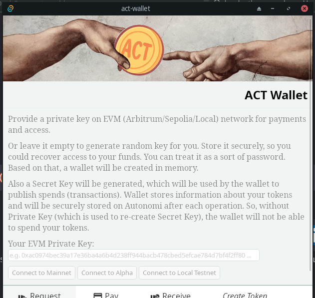
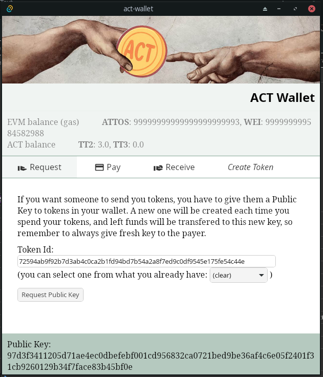
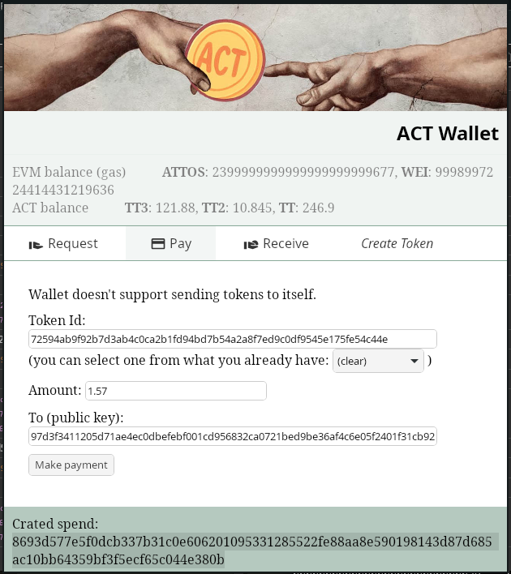
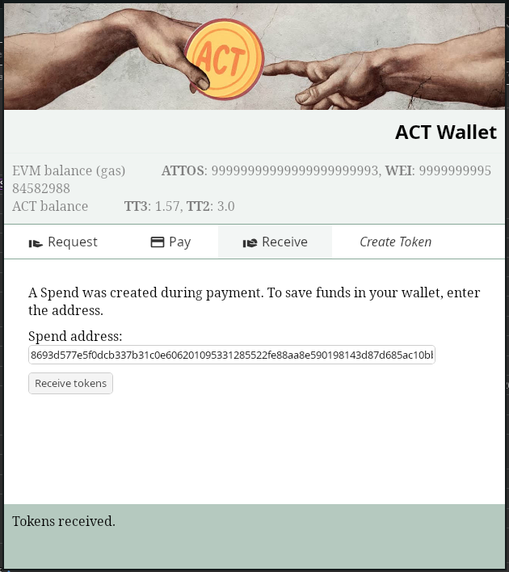
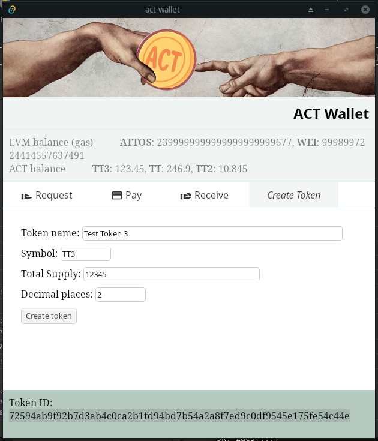

# Basic wallet app usage

You can [download application from GitHub Releases](https://github.com/safenetforum-community/community-token/releases) and install it on your computer, or [run from sources](../README.md#running-from-sources).

## Connecting

When connecting to the network, you need to provide your Arbitrum (EVM) account Private (Secret) Key in hex format, something like `0xac0974bec39a17e36ba4a6b4d238ff944bacb478cbed5efcae784d7bf4f2ff80` (first two characters, "0x" can be omitted). You can usually get this key from your EVM wallet, like MetaMask.

Once you pasted the key, you have to select which network you want to connect to – local test network, or Autonomi Mainnet. Alpha network is going to be turned off soon.

Notice, that you will need some tokens (ETH and AUTONOMI) on your account to use the application. It has to create a scratchpad with your ACT wallet data, even if you are not going to make any transactions. And transactions also require some fee, because they store data on Autonomi.

After connecting, your EVM (AUTONOMI and Arbitrum ETH) and ACT balances should become visible.

## Requesting payment

Before any transaction, a request has to be made. This internally creates a Public Key (pubkey in short) entry in your (requester's) wallet. This pubkey is used to send tokens to you. There's distinct pubkey for every token, so if you request another token, second pubkey will be generated. You can request and [receive](#receiving-a-payment) same token multiple times to one pubkey (there's no need to make new request, it will give you the same pubkey), until you make a payment with that token, because then this pubkey is used, and a new pubkey will be generated.

To make a request, you have to select a token if you have it already in your wallet, or enter token's ID if it's new for you.

**Public Key** is displayed at the bottom if the request succeeds. You have to give it to a person, who's making a payment.

## Making a payment

If you have been given a Public Key, you can make a payment. Just select appropriate token (or enter its ID), enter recipient's pubkey and amount of tokens that you want to send.

The transaction will be created, that gathers all payments, that were made to you earlier (and you have written their addresses to your wallet by [receiving](#receiving-a-payment) them). Part of the joined payments will be directed to the receipient's pubkey (ready to be received), and the rest is automatically received back to your wallet, to a new pubkey, for later use.

Your pubkey, to which you received your tokens earlier, will become unusable. New tokens should be sent to you to a new pubkey, so you will have to [make a request](#requesting-payment) to see it.

If the transaction is made successfully, you should see a **Spend Address** on the bottom of the window. Give this to the receipient, so that he could receive your payment.

## Receiving a payment

When you get a Spend Address of the transaction, that is directed to one of your active public keys, you need to receive it to save it into your wallet for later use. Just paste the Spend Address and click "Receive". Your balance of tokens should change.

## Token creation

Creating tokens is very easy. Just fill all the token's data and voilla! You can send newly created assets to your friends!

* **Token name**: this is the full name of the token.
* **Symbol**: the shortened name. Try to keep it as short as possible, best is 3-5 capital letters.
* **Decimal places**: it's how many parts there will be in 1 token. A real currency example – dollars have 2 decimal places, because there are 100 cents in every dollar. A standard in ERC-20 tokens (similar system in Ethereum network) is 18 decimal places.
* **Total supply**: How much token parts there will be at all. Notice, that if you have 2 decimal places, and want to create 1000 tokens overall, total supply will be 100000.

When token is created, you will receive all the total supply to your wallet, and a **Token ID** will be printed at the bottom. Give this Token ID to somebody you want to send money to, it's needed to [make a request](#requesting-payment).
