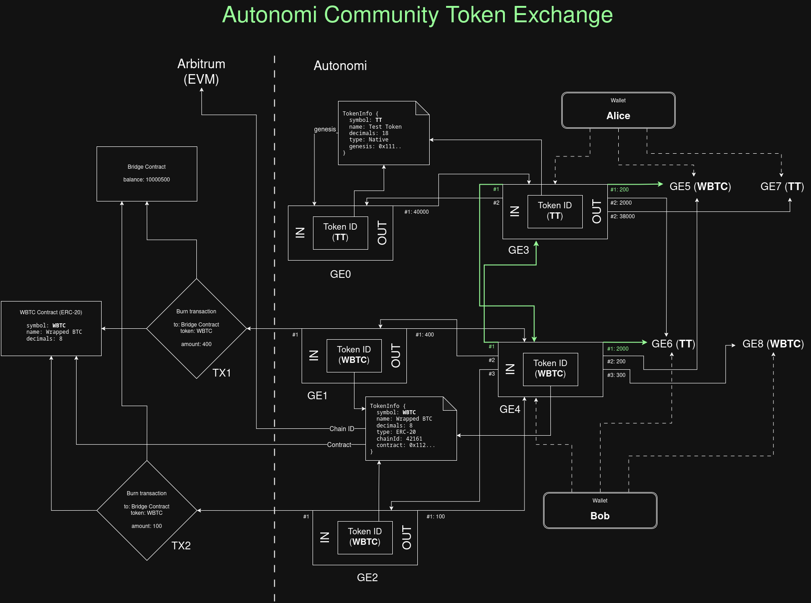

# Autonomi Community Token Exchange

Exchange is be based on both sides publishing a spend transaction Graph Entries, that are connected by inputs/outputs. Each transaction has it's own Token ID, and it will be a single exception in transaction validation process, when Token IDs can differ in parent/child relation.

Exchange process requires a separate means of announcing offers and finding buyers. This can be based on Autonomi, and such solution will be proposed later, but it's not a part of the protocol.

## Exchange Process

1. Initial state. Alice has 40000 TT on GE3, Bob has 500 WBTC on GE4

TT: Native, genesis: GE0, [...]
WBTC: ERC20, [...]

GE0/Alice (ID: TT, in [], out [GE3: 40000])
GE1/Bob (ID: WBTC, in [TX1], out [GE4: 400])
GE2/Bob (ID: WBTC, in [TX2], out [GE4: 100])
(GE3/Alice)
(GE4/Bob)

2. (out of band) Alice gives GE0 (proof), GE3 (exchange) and GE5 (target) PKs to Bob, Bob gives GE1 and GE2 (proofs) GE4 (exchange) and GE6 (target) PKs to Alice. They agree on the amounts, rate etc.

GE0/Alice (ID: TT, in [], out [GE3: 40000])
GE1/Bob (ID: WBTC, in [TX1], out [GE4: 400])
GE2/Bob (ID: WBTC, in [TX2], out [GE4: 100])
(GE3/Alice)
(GE4/Bob)
(GE5/Alice)
(GE6/Bob)

3. Alice checks, that Bob has unspent agreed amount on GE4, and publishes exchange GE3 with inputs GE4 (want_from) and GE0 (source), outputs GE5 (200, want_to), 2000 to Bob's GE6 and 38000 (rest) to own GE7.
This means proposing 2000 TT to Bob in exchange for 200 WBTC. GE3 will be valid only if Bob publishes GE4 and GE3 will fulfill it.

GE0/Alice (ID: TT, in [], out [GE3: 40000])
GE1/Bob (ID: WBTC, in [TX1], out [GE4: 400])
GE2/Bob (ID: WBTC, in [TX2], out [GE4: 100])
GE3/Alice (ID: TT, in [GE4, GE0], out [GE5: 200, GE6: 2000, GE7: 38000])
(GE4/Bob)
(GE5/Alice)
(GE6/Bob)
(GE7/Alice)
(GE8/Bob)

4. Bob checks, that Alice has unspent agreed amount on GE3, and publishes exchange GE4 with inputs GE3 (want_from) GE1 and GE2 (sources), outputs GE6 (2000, want_to), 200 to Alice's GE5 and rest to own GE8.
This means accepting 2000 TT from Alice in exchange for 200 WBTC.

GE0/Alice (ID: TT, in [], out [GE3: 40000])
GE1/Bob (ID: WBTC, in [TX1], out [GE4: 400])
GE2/Bob (ID: WBTC, in [TX2], out [GE4: 100])
GE3/Alice (ID: TT, in [GE4, GE0], out [GE5: 200, GE6: 2000, GE7: 38000])
GE4/Bob (ID: WBTC, in [GE3, GE1, GE2], out [GE6: 2000, GE5: 200, GE8: 300])
(GE5/Alice)
(GE6/Bob)
(GE7/Alice)
(GE8/Bob)

5. Bob can spend his 2000 TT from GE6 and 300 WBTC from GE8, Alice can spend her 200 WBTC from GE5, and 38000 TT from GE7.

## Validation

GE is an exchange if:
* It has more than 1 input and more than 1 output.
* First input GE have different token id, than rest of the input GEs.

Exchange GE1 is valid if:
* Its first output GE2 fulfills it
* It *fulfills* its first input GE2, which means:
  * It is GE2's first input
  * One of its outputs is equal (amount and address) to GE2's first output
* Rest of the inputs have same token IDs, equal exchange GE's token id
* Their sum is equal sum of second and subsequent outputs
* (rest of the rules are the same as in standard GE validation)

## Diagram

[source](ACT Exchange.drawio)

